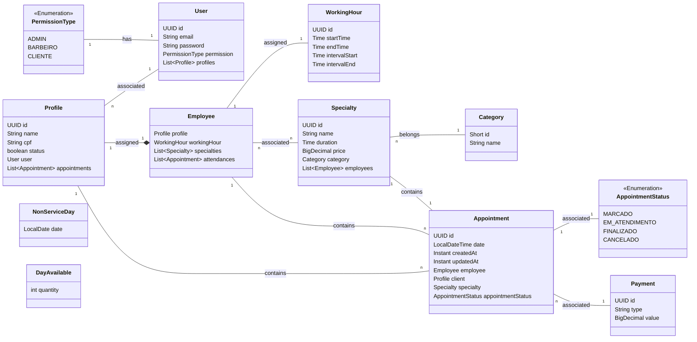

## 🍃 Deploy da Aplicação

O [deploy da aplicação](https://jubas-backend.onrender.com/swagger-ui.html) do Ecossistema Jubas já está disponível. Por favor, note que pode haver uma demora inicial no carregamento do container devido ao serviço gratuito utilizado. Agradeço pela sua compreensão.

---

<h3 align="center">
  Backend do Ecossistema Jubas
</h3>

  
  
  
  

## :straight_ruler: Diagrama de Classes

## :wrench: Tecnologias utilizadas

* Docker
* Java 17
* JUnit
* Mockito
* MySQL
* Spring Boot
* Swagger

Desenvolvido por Marcelo Santana
