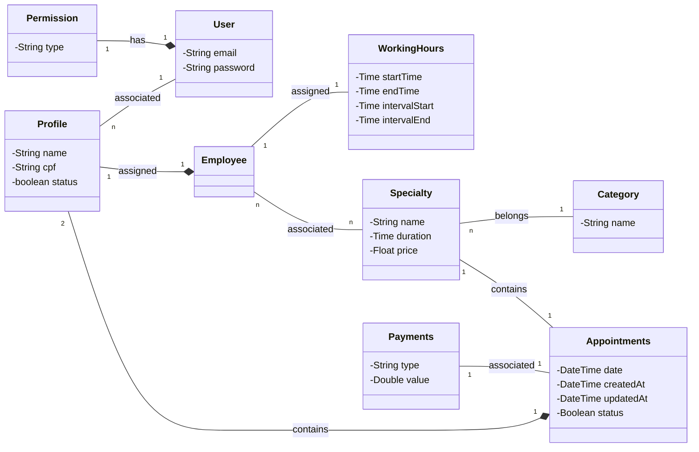

<h3 align="center">
  Backend do Ecossistema Jubas
</h3>

  
  

## :straight_ruler: Diagrama de Classes

## :wrench: Tecnologias utilizadas

* Docker
* Java 17
* JUnit
* Mockito
* MySQL
* Spring Boot
* Swagger

Developed by Marcelo Santana
