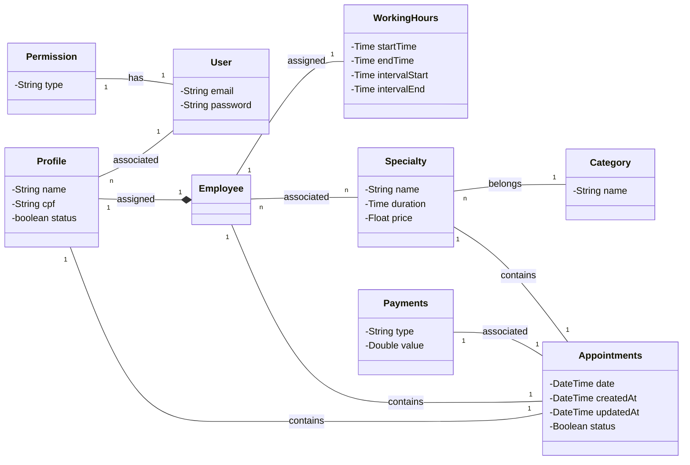

## 🍃 Deploy da Aplicação

O [deploy da aplicação](https://jubas-backend.onrender.com/swagger-ui.html) do Ecossistema Jubas já está disponível. Por favor, note que pode haver uma demora inicial no carregamento do container devido ao serviço gratuito utilizado. Agradeço pela sua compreensão.

---

<h3 align="center">
  Backend do Ecossistema Jubas
</h3>

  
  
  
  

## :straight_ruler: Diagrama de Classes

```mermaid
classDiagram
    direction LR
    Permission "1" -- "1" User : has
    
    Profile "n" -- "1" User : associated 
    
    Profile "1" --* "1" Employee : assigned

    Employee "1" -- "1" WorkingHours : assigned

    Employee "n" -- "n" Specialty : associated
    
    Specialty "n" -- "1" Category : belongs

    Employee "1" -- "1" Appointments : contains

    Profile "1" -- "1" Appointments : contains
    
    Specialty "1" -- "1" Appointments : contains
    
    Payments "1" -- "1" Appointments : associated

    class Permission {
        -String type
    }

    class User {
        -String email
        -String password
    }

    class Profile {
        -String name
        -String cpf
        -boolean status
    }

    class Employee {
    }

    class WorkingHours {
        -Time startTime
        -Time endTime
        -Time intervalStart
        -Time intervalEnd
    }

    class Specialty {
        -String name
        -Time duration
        -Float price  
    }

    class Category {
        -String name
    }

    class Appointments {
        -DateTime date
        -DateTime createdAt
        -DateTime updatedAt
        -Boolean status
    }

    class Payments {
        -String type
        -Double value
    }
```

## :wrench: Tecnologias utilizadas

* Docker
* Java 17
* JUnit
* Mockito
* MySQL
* Spring Boot
* Swagger

Desenvolvido por Marcelo Santana
